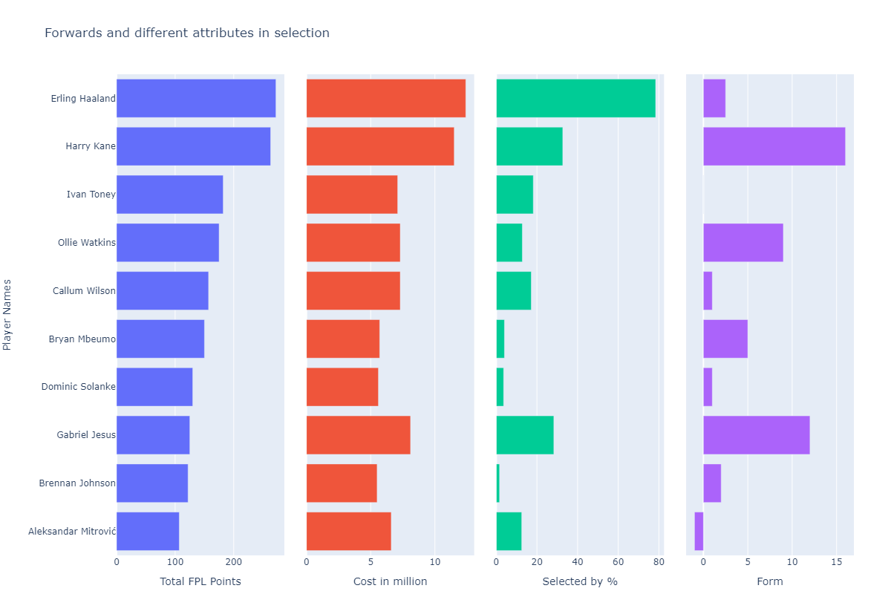
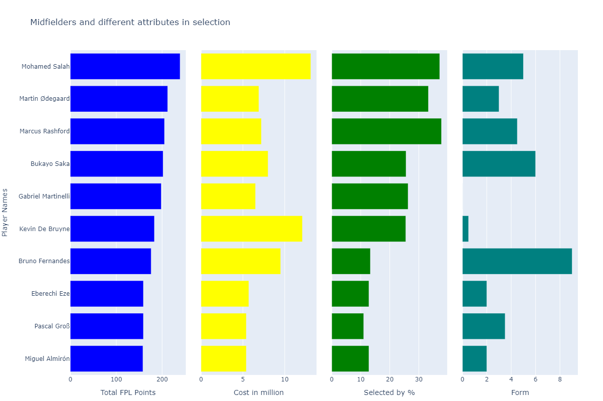
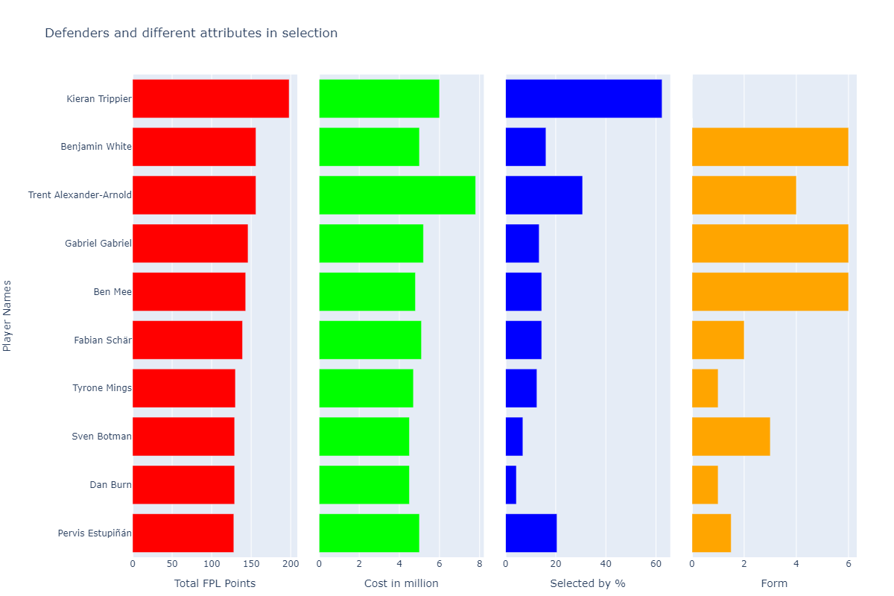
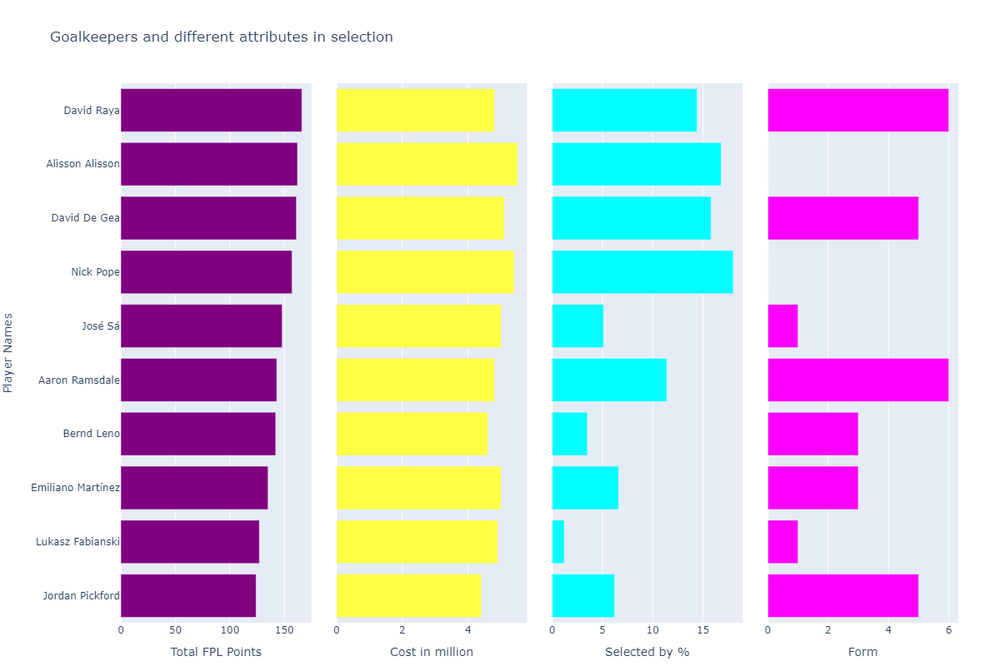
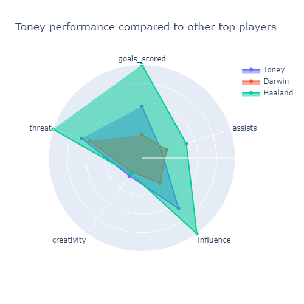
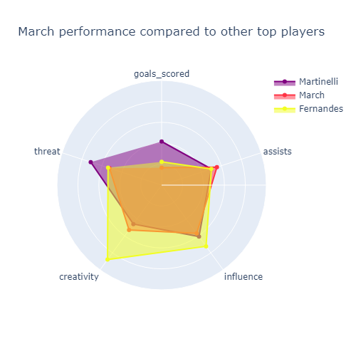
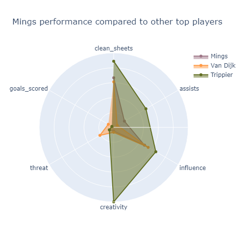
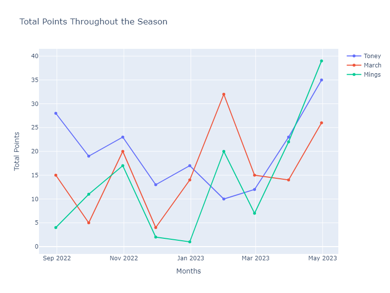

# FPL Blueprint

The popular online game Fantasy Premier League (FPL) is aimed at passionate Premier League football fans. Fans create and manage their dream squad out of players that play for Premier League teams in either private or public competitions. Fans may control a virtual dream team by selecting the club's captain and deciding on a plan to score as many points as they can. The number of points a player receives is based on how well they perform in actual matches. To win this game, fans must be mindful of their financial constraints, refrain from signing some of the leagues' best players, and seek the Premier League's "hidden gems."
Data is gathered from the Fantasy Premier League's API, where relevant data was chosen for analysis of the ideal fantasy team for the Premier League.

Data have been sorted in Figure 1 based on the player with the most points. The player with the most points thus far is Erling Haaland. It is found that Toney is one of the unsung forwards who has scored nearly 200 points while only costing slightly more than half of Haaland. Haaland is a well-liked favorite, while few people have chosen Toney despite his good recent play. 

We can see in Figure 2 that Martinelli, while only costing $6.8 million, is the top midfielder this season with the greatest point total. Midfielders like March, who cost far less than stars like Fernandes, are also doing better. 
 

Figure 3 demonstrates Trippier has done incredibly well and is the popular favorite, even though Mings, who is less expensive is also doing well. Despite his incredible form, Mings hasn't been selected by a lot of fans for their squad.

Price of keepers has little variation, as seen in Figure 4. Thus, we could choose the best possible keeper. 

From Figure 5 it can be determined that Toney has outperformed players like Darwin Nunez even though he hasn't yet reached the same level of excellence as the outstanding Haaland. He has excelled in terms of goal scoring, creativity, threats on goal, and influence on the squad.

 
Figure 6 shows that Martinelli gave a terrific performance this season, but March did fairly well considering how much he costs and his performance has topped Fernandes.

Figure 7 shows one of the top defenders in the league this season, Trippier has performed admirably. While Van Dijk, who many would consider to be a favourite is a threat on goal but has not played well or given his all. On the other side, Mings has done better than Van Dijk in terms of defence, assists, and impact within the squad.

We examine the players' point trends for each month this season to see if they should be kept on the dream team or not. Figure 8 shows Toney, March, and Mings are doing well because their points are on the rise, although March's performance has been mixed recently despite being great throughout the season.
